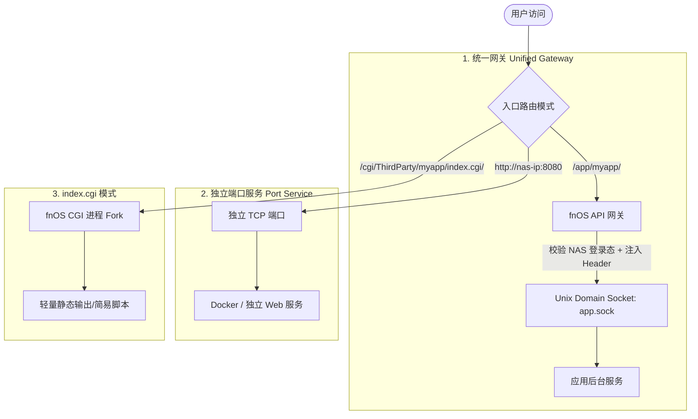

# 飞牛 fnOS 应用开发全景指南

> 基于飞牛应用开放平台（fnOS Developer Platform）官方文档与开放 API 规范整理。

---

## 目录

- [1. 飞牛 fnOS 应用生态与架构概览](#1-飞牛-fnos-应用生态与架构概览)
- [2. 应用包结构与目录规范](#2-应用包结构与目录规范)
- [3. 核心配置文件详解](#3-核心配置文件详解)
  - [3.1 manifest（元数据清单）](#31-manifest元数据清单)
  - [3.2 config/privilege（权限与 Scope）](#32-configprivilege权限与-scope)
  - [3.3 config/resource（系统资源声明）](#33-configresource系统资源声明)
  - [3.4 app/ui/config（桌面与入口配置）](#34-appuiiconfig桌面与入口配置)
  - [3.5 wizard/（用户向导配置）](#35-wizard用户向导配置)
  - [3.6 图标规范（ICON.PNG / ICON_256.PNG）](#36-图标规范iconpng--icon_256png)
- [4. 应用生命周期与脚本体系（cmd/）](#4-应用生命周期与脚本体系cmd)
  - [4.1 控制脚本 main](#41-控制脚本-main)
  - [4.2 安装、升级、卸载回调脚本](#42-安装升级卸载回调脚本)
  - [4.3 环境变量大全](#43-环境变量大全)
- [5. 三大接入与访问模型](#5-三大接入与访问模型)
  - [5.1 统一网关（Unified Gateway，推荐）](#51-统一网关unified-gateway推荐)
  - [5.2 独立端口服务（Port Service）](#52-独立端口服务port-service)
  - [5.3 CGI 轻量入口（index.cgi）](#53-cgi-轻量入口indexcgi)
- [6. 应用形态开发实战](#6-应用形态开发实战)
  - [6.1 Native 应用开发（以 Node.js / React 为例）](#61-native-应用开发以-nodejs--react-为例)
  - [6.2 Docker 应用开发（基于 Compose 容器化）](#62-docker-应用开发基于-compose-容器化)
- [7. 开放 API 与 前端 JS SDK 体系](#7-开放-api-与-前端-js-sdk-体系)
  - [7.1 权限声明（API Scope）](#71-权限声明api-scope)
  - [7.2 前端 JS SDK（@trim/app-sdk）能力](#72-前端-js-sdktrimapp-sdk能力)
  - [7.3 后端 REST API 接入与鉴权](#73-后端-rest-api-接入与鉴权)
  - [7.4 常见错误码与排障](#74-常见错误码与排障)
- [8. 开发者工具链（fnpack 与 appcenter-cli）](#8-开发者工具链fnpack-与-appcenter-cli)
  - [8.1 fnpack 打包与校验工具](#81-fnpack-打包与校验工具)
  - [8.2 appcenter-cli 设备端调试工具](#82-appcenter-cli-设备端调试工具)
- [9. 测试验证与上架发布流程](#9-测试验证与上架发布流程)

---

## 1. 飞牛 fnOS 应用生态与架构概览

飞牛 fnOS 旨在打造“存储系统界的 Windows”。应用生态以服务本地数据安全、私有云家庭娱乐、办公协同与 AI 算力为核心。

- **应用包格式**：`.fpk`（fnOS Package）。
- **运行机制**：应用以宿主隔离的专用用户身份运行，数据与配置与系统核心分离持久化。
- **集成深度**：通过统一网关无缝接入 fnOS 桌面、登录态体系、系统主题与国际化，通过开放 API 与用户授权机制安全访问 NAS 文件系统。

---

## 2. 应用包结构与目录规范

应用安装到 fnOS 设备后，根目录位于 `/var/apps/{appname}`：

```text
/var/apps/{appname}
├── manifest              # 应用元数据清单（必需，无扩展名）
├── ICON.PNG              # 应用小图标（64 x 64 px）
├── ICON_256.PNG          # 应用大图标（256 x 256 px）
├── cmd/                  # 核心生命周期脚本目录
│   ├── main              # 进程管理脚本（start | stop | status | log）
│   ├── install_init      # 安装前预检
│   ├── install_callback  # 安装后初始化
│   ├── upgrade_init      # 升级前处理
│   ├── upgrade_callback  # 升级后迁移
│   ├── uninstall_init    # 卸载前清理
│   ├── uninstall_callback# 卸载后处理
│   ├── config_init       # 设置向导前
│   └── config_callback   # 设置向导后应用配置
├── config/               # 权限与资源定义
│   ├── privilege         # 运行用户与 API Scope 权限配置
│   └── resource          # 共享目录等系统资源声明
├── wizard/               # 用户安装/升级向导表单（JSON）
│   ├── install
│   ├── upgrade
│   ├── uninstall
│   └── config
├── app/ -> target        # 解压后的应用代码及静态资源（指向 /vol{n}/@appcenter/{appname}）
├── etc                   # 应用配置持久化目录（软链至 /vol{n}/@appconf/{appname}）
├── var                   # 应用运行数据持久化目录（软链至 /vol{n}/@appdata/{appname}）
├── tmp                   # 应用临时目录（软链至 /vol{n}/@apptemp/{appname}）
├── home                  # 应用专用家目录（软链至 /vol{n}/@apphome/{appname}）
├── shares/               # 声明的数据共享软链目录
└── meta                  # 应用包元数据缓存
```

---

## 3. 核心配置文件详解

### 3.1 manifest（元数据清单）

文件路径：`manifest`（位于根目录，无后缀名，采用 Key-Value 格式）

```ini
# --- 基础信息 ---
appname=myapp
version=1.0.0
display_name=我的应用
desc=这是一个在飞牛 fnOS 上运行的高性能应用。
source=thirdparty

# --- 架构与系统兼容 ---
platform=all                   # 支持架构：x86 / arm / all
os_min_version=1.2.0401        # 最低支持系统版本
os_max_version=                # 最高支持版本（选填）

# --- 开发者信息 ---
maintainer=DeveloperName
maintainer_url=https://developer.example.com
distributor=DeveloperName
distributor_url=https://developer.example.com

# --- 运行控制 ---
ctl_stop=true                  # 是否在应用中心显示“启动/停止”按钮
install_type=                  # 留空：用户选安装存储池；root：安装到系统盘

# --- 依赖声明 ---
install_dep_apps=nodejs_v22    # 运行时/中间件依赖，多个用冒号分隔，如：nodejs_v22:redis

# --- 桌面与入口 ---
desktop_uidir=ui
desktop_applaunchname=myapp_entry
service_port=                  # 独立端口服务填端口号；统一网关模式可留空
checkport=false                # 启动前是否做端口占用探测

# --- 功能控制 ---
disable_authorization_path=false # 是否在应用中心设置页隐藏授权目录选项
changelog=初始版本上线
```

---

### 3.2 config/privilege（权限与 Scope）

文件路径：`config/privilege`（JSON 格式）

```json
{
  "defaults": {
    "run-as": "package"
  },
  "username": "myapp",
  "groupname": "myapp",
  "api-scope": [
    "trim.file.sharedAccess",
    "trim.file.userAccess",
    "trim.file.userAcl",
    "trim.file.path",
    "trim.system.getPlatformConfig"
  ]
}
```

---

### 3.3 config/resource（系统资源声明）

文件路径：`config/resource`（JSON 格式），常用于向系统声明共享数据目录：

```json
{
  "data-share": {
    "shares": [
      {
        "name": "myapp-media",
        "permission": "readwrite",
        "description": "应用共享媒体文件夹"
      }
    ]
  }
}
```

---

### 3.4 app/ui/config（桌面与入口配置）

文件路径：`app/ui/config`（JSON 格式），定义用户点击桌面图标或打开文件时的行为：

```json
{
  ".myapp_entry": {
    "title": "我的应用",
    "desc": "在 fnOS 中打开我的应用",
    "icon": "icon.png",
    "type": "app",
    "protocol": "",
    "port": "",
    "url": "/app/myapp/",
    "gatewayPrefix": "/app/myapp",
    "gatewaySocket": "app.sock",
    "allUsers": true
  }
}
```

---

### 3.5 wizard/（用户向导配置）

支持在安装、升级或配置时弹窗引导用户输入参数。字段值会在执行生命周期脚本时自动转为**环境变量**：

文件路径：`wizard/install`（JSON 数组）

```json
[
  {
    "stepTitle": "基础配置",
    "items": [
      {
        "field": "service_port_cfg",
        "label": "服务运行端口",
        "type": "number",
        "default": 8080,
        "required": true
      },
      {
        "field": "admin_password",
        "label": "管理员初始密码",
        "type": "password",
        "required": true
      }
    ]
  }
]
```

---

### 3.6 图标规范（ICON.PNG / ICON_256.PNG）

- `ICON.PNG`：64 × 64 像素，PNG 格式，用于列表展示。
- `ICON_256.PNG`：256 × 256 像素，PNG 格式，用于桌面及详情卡片。
- `app/ui/icon.png`：用于应用入口的图标。

---

## 4. 应用生命周期与脚本体系（cmd/）

### 4.1 控制脚本 main

`cmd/main` 是系统管理进程生命周期的核心脚本，必须具备可执行权限（`chmod +x`），支持传入参数：`start`、`stop`、`status`、`log`。

```bash
#!/bin/bash
ACTION=$1

PID_FILE="${TRIM_PKGVAR}/app.pid"
LOG_FILE="${TRIM_PKGVAR}/app.log"
APP_DIR="${TRIM_APPDEST}"

start() {
    if [ -f "$PID_FILE" ] && kill -0 $(cat "$PID_FILE") 2>/dev/null; then
        echo "Application is already running."
        exit 0
    fi

    # 启动应用（以 Unix Socket 模式运行）
    nohup node "${APP_DIR}/backend/server.js" \
        --socket "${APP_DIR}/app.sock" \
        >> "$LOG_FILE" 2>&1 &
    
    echo $! > "$PID_FILE"
}

stop() {
    if [ -f "$PID_FILE" ]; then
        PID=$(cat "$PID_FILE")
        kill "$PID" 2>/dev/null
        rm -f "$PID_FILE"
    fi
}

status() {
    if [ -f "$PID_FILE" ] && kill -0 $(cat "$PID_FILE") 2>/dev/null; then
        exit 0
    fi
    exit 1
}

case "$ACTION" in
    start)
        start
        ;;
    stop)
        stop
        ;;
    status)
        status
        ;;
    log)
        echo "$LOG_FILE"
        ;;
    *)
        echo "Usage: $0 {start|stop|status|log}"
        exit 1
        ;;
esac
```

---

### 4.2 安装、升级、卸载回调脚本

- `install_init` / `install_callback`：安装前环境校验、安装后配置生成与数据迁移。
- `upgrade_init` / `upgrade_callback`：版本升级时的数据备份与格式升级。
- `uninstall_init` / `uninstall_callback`：卸载时的容器停止、资源释放（可选择是否保留用户数据）。

> 💡 **错误处理**：若生命周期脚本失败，可在退出前将报错信息写入 `${TRIM_TEMP_LOGFILE}`，然后 `exit 1`，fnOS 会在界面上把该错误提示展示给用户。

---

### 4.3 环境变量大全

| 环境变量名 | 说明 |
| :--- | :--- |
| `TRIM_APPNAME` | 应用唯一包名（来自 `manifest.appname`） |
| `TRIM_APPVER` | 当前运行的应用版本 |
| `TRIM_APP_STATUS` | 当前生命周期动作（`INSTALL`, `START`, `UPGRADE`, `UNINSTALL`, `STOP` 等） |
| `TRIM_APPDEST` | 应用解压安装的目标路径（即 `target`） |
| `TRIM_PKGETC` | 应用配置目录（对应 `/vol{n}/@appconf/{appname}`） |
| `TRIM_PKGVAR` | 应用持久化数据目录（对应 `/vol{n}/@appdata/{appname}`） |
| `TRIM_PKGTMP` | 应用临时文件目录（对应 `/vol{n}/@apptemp/{appname}`） |
| `TRIM_PKGHOME` | 应用用户家目录 |
| `TRIM_USERNAME` / `TRIM_GROUPNAME` | 应用专属包用户/组名称 |
| `TRIM_UID` / `TRIM_GID` | 应用运行用户 UID / GID |
| `TRIM_SERVICE_PORT` | `manifest` 中声明的端口号 |
| `TRIM_DATA_SHARE_PATHS` | 系统分配的共享数据目录路径（冒号分隔） |
| `TRIM_DATA_ACCESSIBLE_PATHS` | 用户或管理员授权的可访问数据目录路径（冒号分隔） |
| `TRIM_API_TOKEN` | 访问 fnOS 开放 API 所需的 Bearer 认证 Token |
| `TRIM_SYS_VERSION` | 当前飞牛 fnOS 完整版本号 |
| `TRIM_SYS_ARCH` | CPU 架构（如 `x86_64`, `aarch64`） |
| `TRIM_SYS_LANGUAGE` | 系统当前界面语言（如 `zh-CN`, `en-US`） |

---

## 5. 三大接入与访问模型



### 5.1 统一网关（Unified Gateway，推荐）

- **优势**：
  1. 复用系统主域名与端口，无需额外开启路由器端口转发。
  2. 自动集成 NAS 登录态鉴权。
  3. 支持 HTTP 1.1/2 及 **WebSocket** 长连接。
  4. 自动通过 Request Header 注入用户信息：
     - `X-Trim-User-Id`：当前登录用户的 ID
     - `X-Trim-Username`：当前登录用户名
     - `X-Trim-Is-Admin`：是否为管理员（`true` / `false`）
- **配置方式**：在 `app/ui/config` 中配置 `gatewayPrefix: "/app/{appname}"` 与 `gatewaySocket: "app.sock"`。

### 5.2 独立端口服务（Port Service）

- **适用场景**：大型已有服务、需直接对外暴露独立端口的容器（如 Nextcloud、Jellyfin）。
- **配置方式**：在 `manifest` 中声明 `service_port=8080`，`app/ui/config` 中配置端口。

### 5.3 CGI 轻量入口（index.cgi）

- **适用场景**：仅展示纯静态 HTML 介绍页、无需常驻后台进程的微型工具。
- **机制**：每次访问 Fork 执行 `app/ui/index.cgi`，不支持长连接与 WebSocket。

---

## 6. 应用形态开发实战

### 6.1 Native 应用开发（以 Node.js / React 为例）

1. **项目源码组织**：
   - `frontend/`：React / Vue / 原生 JS 构建前端，生成静态资源放入 `app/ui/`。
   - `backend/`：Node.js 服务，监听 Unix Domain Socket：
     ```javascript
     const express = require('express');
     const fs = require('fs');
     const app = express();

     // 解析网关传递的用户 Header
     app.use((req, res, next) => {
       req.currentUser = {
         id: req.headers['x-trim-user-id'],
         username: req.headers['x-trim-username'],
         isAdmin: req.headers['x-trim-is-admin'] === 'true'
       };
       next();
     });

     app.get('/api/notes', (req, res) => {
       res.json({ message: `Hello ${req.currentUser.username}` });
     });

     const socketPath = process.argv[3] || './app.sock';
     if (fs.existsSync(socketPath)) fs.unlinkSync(socketPath);

     app.listen(socketPath, () => {
       fs.chmodSync(socketPath, '0777');
       console.log(`Server listening on socket ${socketPath}`);
     });
     ```
2. **声明依赖**：在 `manifest` 设置 `install_dep_apps=nodejs_v22`。

---

### 6.2 Docker 应用开发（基于 Compose 容器化）

1. **使用脚手架创建**：
   ```bash
   fnpack create my-docker-app --template docker
   ```
2. **docker-compose.yml 示例**：
   ```yaml
   version: '3.8'
   services:
     web:
       image: nginx:alpine
       restart: always
       ports:
         - "${service_port}:80"
       volumes:
         - "${TRIM_PKGVAR}/data:/usr/share/nginx/html"
         - "${TRIM_PKGETC}/nginx.conf:/etc/nginx/nginx.conf:ro"
   ```
3. `cmd/main` 脚本中调用 `docker compose -f ... up -d` 与 `down`。

---

## 7. 开放 API 与 前端 JS SDK 体系

### 7.1 权限声明（API Scope）

在 `config/privilege` 中声明：

| API Scope | 对应功能 |
| :--- | :--- |
| `trim.file.sharedAccess` | 管理员为应用授权公共共享目录，后端查询/管理共享授权 |
| `trim.file.userAccess` | 当前用户在应用内授权个人目录或文件 |
| `trim.file.userAcl` | 后端检查特定用户对指定路径的读写/删除权限 |
| `trim.file.path` | 将内部路径（如 `/vol1/1000/data`）转换为用户友好路径 |
| `trim.system.getPlatformConfig` | 读取系统版本、界面语言、主题偏好等 |

---

### 7.2 前端 JS SDK（@trim/app-sdk）能力

#### ① 初始化与平台状态
```javascript
import { sdk } from '@trim/app-sdk';

// 1. 获取平台配置
const config = await sdk.system.getPlatformConfig();
console.log(config.language, config.theme, config.systemVersion);

// 2. 监听宿主主题与语言变化（仅 Web 宿主桌面环境有效）
sdk.ui.onThemeChange((theme) => {
  document.body.className = theme; // 'light' | 'dark'
});
sdk.ui.onLanguageChange((lang) => {
  i18n.changeLanguage(lang);
});

// 3. 设置窗口标题与离开拦截
sdk.ui.setTitle("文档编辑 - 我的应用");
sdk.ui.setLeaveConfirm(true, "当前有未保存的改动，确定离开吗？");
```

#### ② 文件与目录授权选择器
```javascript
// 管理员共享目录授权
const sharedDir = await sdk.authorization.pickSharedFile({
  title: "选择应用存储目录",
  selectType: "directory"
});

// 用户个人文件授权
const userFiles = await sdk.authorization.pickUserFile({
  title: "选择要导入的文件",
  selectType: "file",
  multiSelect: true
});
```

#### ③ 系统路由与应用联动
```javascript
// 打开文件详情
sdk.routing.openFileDetail({ path: "/vol1/photos/test.jpg" });

// 打开系统文件管理器并定位到目录
sdk.routing.openFileManager({ path: "/vol1/downloads" });

// 打开应用自身在 fnOS 系统的设置页
sdk.routing.openAppSetting();
```

---

### 7.3 后端 REST API 接入与鉴权

后端发起 HTTP 请求时，携带环境变量 `${TRIM_API_TOKEN}`：

- **请求头**：`Authorization: Bearer <TRIM_API_TOKEN>`
- **核心接口列表**：
  1. `POST /api/v1/auth/shared/list`：查询管理员授予的所有共享路径。
  2. `POST /api/v1/auth/user/list`：按 `userId` 查询用户的已授权目录。
  3. `POST /api/v1/file/acl/check`：
     ```json
     {
       "userId": "1001",
       "path": "/vol1/media/video.mp4",
       "action": "read"  // "read" | "write" | "delete"
     }
     ```
  4. `POST /api/v1/file/path/convert`：将内部物理路径转为用户可见路径。

---

### 7.4 常见错误码与排障

- **JSSDK 错误**：
  - `CANCELLED` (1001)：用户主动取消了文件选择器或操作。
  - `PERMISSION_DENIED` (1003)：应用未在 `privilege` 中声明对应的 `api-scope`。
  - `NOT_IN_HOST` (1005)：当前处于独立浏览器页面，部分宿主交互能力不可用。
- **后端 API 错误**：
  - `401 Unauthorized`：`TRIM_API_TOKEN` 无效或已失效。
  - `403 Forbidden`：缺少对应的 API 作用域权限。
  - `404 Not Found`：目标文件或目录不存在。

---

## 8. 开发者工具链（fnpack 与 appcenter-cli）

### 8.1 fnpack 打包与校验工具

`fnpack` 支持 Windows、macOS、Linux (x86 & ARM)：

```bash
# 1. 查看帮助
fnpack --help

# 2. 从模板创建新项目
fnpack create myapp                  # Native 默认模板
fnpack create myapp --template docker # Docker 模板

# 3. 校验应用包目录结构与 manifest 配置规范
fnpack check ./myapp

# 4. 打包输出 .fpk 文件
fnpack build ./myapp -o myapp-1.0.0.fpk
```

---

### 8.2 appcenter-cli 设备端调试工具

在 fnOS 设备终端直接调试：

```bash
# 安装 / 重新安装 FPK
appcenter-cli install-fpk myapp-1.0.0.fpk

# 查看运行状态
appcenter-cli status myapp

# 启动 / 停止应用
appcenter-cli start-app myapp
appcenter-cli stop-app myapp

# 查看应用日志
appcenter-cli log myapp

# 卸载应用
appcenter-cli uninstall-app myapp
```

---

## 9. 测试验证与上架发布流程

### 9.1 发布前测试检查清单

- [ ] **多架构验证**：若声明 `platform=all` 或编译了二进制，确保在 x86_64 及 aarch64 设备均能正常运行。
- [ ] **生命周期测试**：验证 安装 ➔ 启动 ➔ 停止 ➔ 升级 ➔ 卸载 流程无残留无报错。
- [ ] **数据持久化验证**：应用重启、升级后，`/etc` 与 `/var` 中的配置和数据完整保留。
- [ ] **权限与隔离**：应用不能越权访问未授权路径，严格遵循最小权限原则。
- [ ] **UI 适配**：支持 fnOS 浅色 / 深色模式跟随，在 Web 桌面端和移动端内嵌均显示正常。

### 9.2 提交发布材料

1. **`.fpk` 安装包**：使用 `fnpack build` 生成的最终安装包。
2. **图标与截图**：
   - 64x64 `ICON.PNG` 与 256x256 `ICON_256.PNG`。
   - 3~5 张真实操作界面高清截图（展示核心功能，非临时占位图）。
3. **提交渠道**：
   - 当前阶段：通过[飞牛官网](https://www.fnnas.com)加入官方开发者交流群，联系社区主理人提交包体与材料。
   - 后续阶段：直接在飞牛应用开放平台开发者后台在线提交审核。
